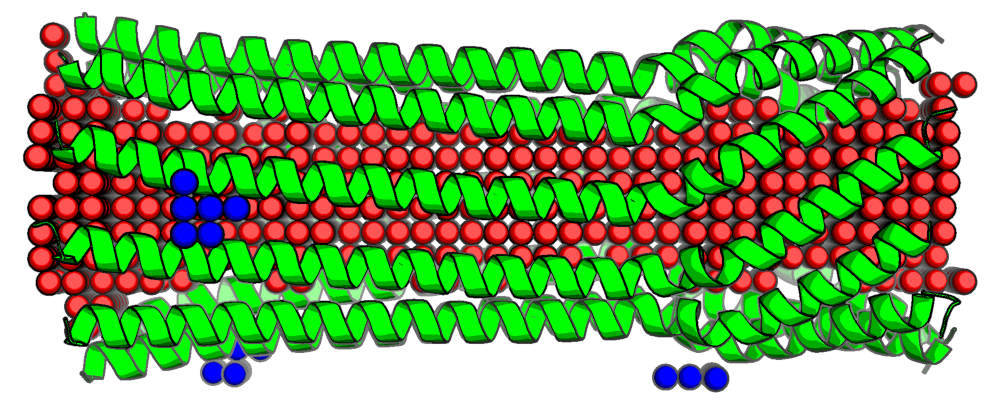
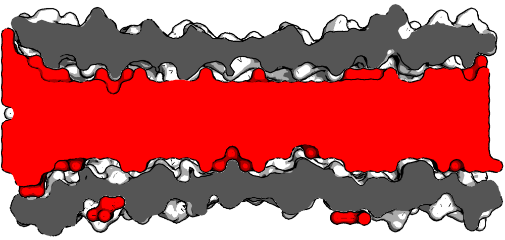

`Porate` discovers and annotates occluded volumes in proteins including:
- Cavities: Volumes within a protein that do not make any contacts with bulk solvent. Useful for e.g. carrying cargo.
- Pockets: Volumes on the protein surface that make a single contact with bulk solvent.  Useful for e.g. ligand binding or catalysis.
- Pores: Volumes connecting two bulk solvent surfaces.  Useful for e.g. filtering solutes.
- Hubs: Volumes connecting more than two bulk solvent surfaces.  Maybe useful for slow release of cargo...

# Example Identified Volume

Here is shown an example pore identified and annotated (red) in PDB 4JPN (green).


The same pore volume annotated (red) shown as a slice through the protein (grey).


# Installation
`Porate` was written to use python 3.9.

## Python Package Installation Using Poetry
`Porate` can be installed and run from a virtual environment using `poetry`, a widely used python virtual environment manager.

```bash
poetry install
```

## Manually Python Package Installation
If you wish to install outside of a poetry managed virtual environment, the 3rd party python packages that need to be installed are:

- typer
- biopython
- pyntcloud
- requests
- progressbar

## Compiling C Source
Several under-the-hood functions are implemented in both python and C.  If the C versions are not compiled performance will be reduced.
To compile them:
```bash
./source/compile_c_libs.sh
```

# Usage
`Porate` can be invoked from the command-line or imported and used within your own python scripts.

## CLI Usage
Note that when first run `porate` will need to download the RCSB components datafile from the public
RCSB database, which is used to optionally clean structures of extraneous atoms (see Flags below).

The CLI can be used with 4 different inputs.

1. A single PDB ID can be supplied.
```bash
python porate 4JPN
```
2. A batch of PDB IDs can be supplied in a text file, one per line.
```bash
python porate <path-to-my-text-file>
```
3. A local PDB file can be supplied.
```bash
python porate <path-to-my-file>
```
4. A batch of PDB files from a directory can be supplied.
```bash
python porate <path-to-my-dir-of-PDBs>
```

### Flags
`resolution` the length of the sides of the voxels constructed.  3 Angstroms is the default.  Smaller values
will result in higher resolution structures but will take longer to annotate.

`non-protein` should non-protein atoms be kept as part of the structure?  False by default which means the structure is
cleaned of explicit waters, salts, ligands, etc.. leaving only protein atoms (both natural and non-natural).

`jobs` how many threads to use for computation.  This only applies when multiple PDBs are being annotated in which
case they are trivially paralellized across threads.

## Python Package Usage
PENDING DOCUMENTATION


# How It Works
`Porate` identifies hydrated volumes in a protein structure that are not fully solvent exposed, e.g. a binding pocket.
It then computes the volume and dimensions of these volumes and outputs that information along with an annotated 
version of the input PDB showing where the volumes are (which can be visualized in e.g. Pymol).

## Identifying hydrated volumes
1. A large voxel-grid is built around the atoms of the protein or other structure supplied.
2. All voxels within a van der Waals radius of a protein or other atom is flagged as being `non-solvent`
3. Remaining `solvent` atoms are then broken into two groups: `bulk solvent` and `occluded volumes`
   This is done by tracing a vector along each ordinal axis from a given voxel and if 2 or more of these vectors would
   cross a `non-solvent` voxel, then the query voxel is identified as an `occluded volume` to be further analyzed
   otherwise it is considered `bulk solvent`
   The intention is to identify points on the grid that are outside the protein as `bulk solvent`
4. All `occluded volume` voxels are then grouped into a number of continuous volumes
5. For each continous volume the number of distinct surfaces that contact `bulk solvent` voxels is computed and used
   to indicate the volume type:
   0 surfaces interacting with solvent: cavity
   1 surface interacting with solvent: pocket
   2 surfaces interacting with solvent: pore
   3+ surfaces interacting with solvent: hub

## Annotations

### Pandas DataFrame
Annotations are given as a pandas data frame saved as a .json file.  The annotation lists all hydrated volumes ordered by
total volume, giving the type of volume, and dimensions.

### PDB File
The input PDB file will be annotated by adding `atoms` to represent the hydrated volumes.  The ATOM entries
contain several points of information about the volume from which they come:

Type of volume: the residue name encodes the type of volume in 3-letter code
OCC for occluded
CAV for cavity
POK for pocket
POR for pore
HUB for hub

Surface of the hydrated volume that interacts with bulk solvent: this is indicated by a B-factor of 50.0, whereas
the remainder of the volume (that does not interact with the bulk solvent) has a value of 0.0.

All `atoms` of a particular volume are grouped under the same residue number.

Finally, several remarks are added:
At the beginning of the file the rotation and translation matrices used to transform the input before voxelization are given.
At the end of the file including the resolution used for the analysis, as well as the total volume and dimensions of significant volumes.
